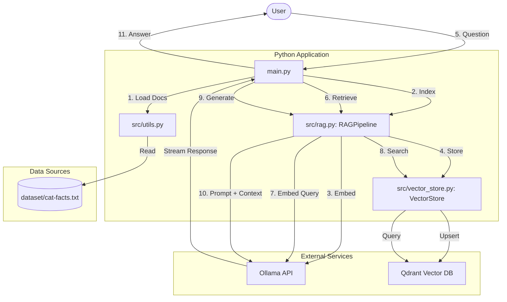

# Simple RAG

This are my first trying to build simple RAG 

refferece : https://huggingface.co/blog/ngxson/make-your-own-rag

Followed or the give steps based on the article I tried to enhance while learn to plug in to increase the complexity and deeper understanding of RAG component that are useful to build RAG application to also configured it to adapt with WSL environment + Ollama Windows setup. So here's what I did ;

First of all after going through the article.

Installing and configuring WSL and Ollama for the codebase 

```bash
# Create the virtual environment
python3 -m venv venv

# Activate the venv
source venv/bin/activate
```
Make sure once the virtual enviroment created install necessary library to code from there.

```bash
pip install -r requirements.txt
```

required model to download : 
```bash
ollama pull hf.co/CompendiumLabs/bge-base-en-v1.5-gguf
ollama pull hf.co/bartowski/Llama-3.2-1B-Instruct-GGUF
```

The proceed with making sure the connetction between the WSL and Ollama is okay

In powershell as Admin
```bash
[System.Environment]::SetEnvironmentVariable('OLLAMA_HOST', '0.0.0.0', 'User')
```
Restart Ollama , 
```bash
stop-process -name "ollama*" -force
# listen everwhere flag
$env:OLLAMA_HOST="0.0.0.0"; ollama serve
```

Now we can see the logs if the Ollama triggered. Its usefull I can see whats happening in the backgrough when we triggered the model.

```powershell
llama_context: Flash Attention was auto, set to enabled
llama_context:      CUDA0 compute buffer size =   254.50 MiB
llama_context:  CUDA_Host compute buffer size =    12.01 MiB
llama_context: graph nodes  = 503
llama_context: graph splits = 2
time=2025-12-26T00:24:53.722+08:00 level=INFO source=server.go:1376 msg="llama runner started in 24.50 seconds"
time=2025-12-26T00:24:53.723+08:00 level=INFO source=sched.go:517 msg="loaded runners" count=2
time=2025-12-26T00:24:53.723+08:00 level=INFO source=server.go:1338 msg="waiting for llama runner to start responding"
time=2025-12-26T00:24:53.724+08:00 level=INFO source=server.go:1376 msg="llama runner started in 24.50 seconds"
[GIN] 2025/12/26 - 00:24:55 | 200 |   26.5510217s |   172.23.165.40 | POST     "/api/chat"

```

Also need to make sure the files names `cat-facts.txt` is available with the correct content from the article.

## How to Run 
Ensure your virtual environment is active and `ollama` is running on Windows.

```bash
# Activate venv
source venv/bin/activate

# Run the chatbot
python main.py
```

## Testing
The project includes a comprehensive test suite using `pytest`.

```bash
# Run all tests
venv/bin/pytest tests/

# Run unit tests only
venv/bin/pytest tests/unit/
```

## Improvement recommendations by the article

- If the question covers multiple topics at the same time, the system may not be able to provide a good answer. This is because the system only retrieves chunks based on the similarity of the query to the chunks, without considering the context of the query.

- The solution could be to have the chatbot to write its own query based on the user's input, then retrieve the knowledge based on the generated query. We can also use multiple queries to retrieve more relevant information.

- The top N results are returned based on the cosine similarity. This may not always give the best results, especially when each chunks contains a lot of information.
To address this issue, we can use a reranking model to re-rank the retrieved chunks based on their relevance to the query.

- The database is stored in memory, which may not be scalable for large datasets. We can use a more efficient vector database such as Qdrant, Pinecone, pgvector (done)

- We currently consider each sentence to be a chunk. For more complex tasks, we may need to use more sophisticated techniques to break down the dataset into smaller chunks. We can also pre-process each chunk before adding them to the database.

- The language model used in this example is a simple one which only has 1B parameters. For more complex tasks, we may need to use a larger language model.

# Enhancements

We have successfully refactored the codebase to support a more modular and scalable architecture. This prepares the project for advanced features like reranking and different vector databases.

## New Directory Structure
The code has been moved from a single `demo.py` file to a structured package in `src/`.

## Key Improvements
- **Modular Design**: Separation of concerns between configuration, storage, and logic.
- **Automatic IP Detection**: `src/config.py` automatically detects the Windows Host IP when running in WSL.
- **Configurable**: Models and Base URLs can be overridden via environment variables.
- **Robustness**: Better error handling for missing files or connection issues.


# Technical Architecture

## RAG Workflow




## Mapping to Codebase

| Stage | Files & Classes / Functions | Description |
| :--- | :--- | :--- |
| **Dataset** | [`dataset/cat-facts.txt`](./dataset/cat-facts.txt) | Raw text source data. |
| **Loading** | [`src/utils.py`](./src/utils.py) -> `load_text_file` | Reads the file and splits it into discrete lines/chunks. |
| **Embedding** | [`src/rag.py`](./src/rag.py) -> `RAGPipeline.embed_text` | Converts text to numerical vectors using **Ollama**. |
| **Storage** | [`src/vector_store.py`](./src/vector_store.py) -> `VectorStore.add` | Stores chunks and embeddings in **Qdrant**. |
| **Retrieval** | [`src/rag.py`](./src/rag.py) -> `RAGPipeline.retrieve` | Orchestrates the similarity search process. |
| **Searching** | [`src/vector_store.py`](./src/vector_store.py) -> `VectorStore.search` | Queries Qdrant for the most relevant context chunks. |
| **Generation** | [`src/rag.py`](./src/rag.py) -> `RAGPipeline.generate_response` | Sends retrieved context + query to **Ollama (LLM)** for response. |
| **Output** | [`main.py`](./main.py) | Streams the generated response back to the user. |
